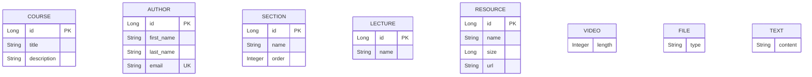

Below is the ER/Class Diagram in **Markdown (Mermaid ER Diagram)** format based on the image:

````md

````

### Spring JPA Mapping

- `Course   ↔  Author` → `@ManyToMany`
- `Course   →  Section` → `@OneToMany`
- `Section  →  Lecture` → `@OneToMany`
- `Lecture  →  Resource` → `@OneToOne`
- `Video`, `File`, `Text` inherit from `Resource` → JPA Inheritance (`@Inheritance(strategy = InheritanceType.JOINED)` recommended)

This diagram represents a typical E-Learning platform structure:

- A course can have multiple authors.
- A course contains multiple sections.
- A section contains multiple lectures.
- A lecture has one resource.
- Resource can be a Video, File, or Text.
